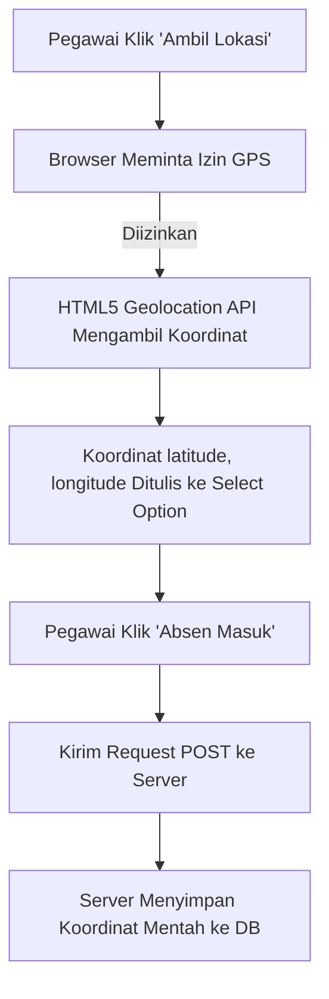

# Panduan & Dokumentasi Fitur Geolokasi - Presensi Disdukcapil

Dokumen ini secara khusus mengupas tuntas sistem **Geolokasi (Location Tracking)** yang diimplementasikan pada project Presensi Disdukcapil, mulai dari konsep dasar, alur data, struktur database, kode implementasi, hingga rekomendasi pengembangan lebih lanjut.

---

## 1. Konsep & Arsitektur Geolokasi

Sistem ini dirancang untuk mencatat posisi geografis (koordinat GPS) pegawai saat mereka melakukan **Absen Masuk**. Tujuannya adalah memastikan bahwa pegawai melakukan presensi dari lokasi fisik tertentu.

### Arsitektur Data:


---

## 2. Struktur Database (Schema)

Informasi geolokasi disimpan di dalam tabel `presensis`. Berikut adalah potongan struktur migrasinya yang berada di file [2024_09_10_012613_create_presensis_table.php](file:///d:/Koding/PRESENSI-DISDUKCAPIL/database/migrations/2024_09_10_012613_create_presensis_table.php):

```php
Schema::create('presensis', function (Blueprint $table) {
    $table->id();
    $table->unsignedBigInteger('user_id');
    $table->date('tanggal');
    $table->string('status')->default('belum di acc');
    $table->string('lokasi', 500); // <-- KOLOM PENYIMPANAN KOORDINAT
    $table->time('jam_masuk')->nullable();
    $table->time('jam_pulang')->nullable();
    $table->timestamps();

    $table->foreign('user_id')->references('id')->on('users')->onDelete('cascade');
});
```

### Karakteristik Kolom `lokasi`:
*   **Tipe Data**: `VARCHAR` dengan panjang maksimal **500 karakter**.
*   **Format Data**: Menyimpan string koordinat GPS yang digabung dengan tanda koma, contoh: `-7.048384, 110.441293` (Format: `latitude, longitude`).

---

## 3. Penelusuran Kode (Code Walkthrough)

### A. Sisi Frontend (Client-Side)
Proses deteksi posisi dilakukan di browser pengguna menggunakan **HTML5 Geolocation API**.
Kode ini terletak di file [index.blade.php](file:///d:/Koding/PRESENSI-DISDUKCAPIL/resources/views/pegawai/presensi/index.blade.php):

#### 1. Form Input (HTML)
```html
<label for="lokasi">Lokasi:</label><br /><br />
<!-- Koordinat terpilih akan dimasukkan sebagai opsi di select box ini -->
<select name="lokasi" id="lokasiSelect" required></select><br /><br />
<button class="btn btn-secondary text-white" type="button" onclick="getLocation()">Ambil Lokasi</button>
```

#### 2. Javascript Logic (JS)
```javascript
// Fungsi dipicu saat tombol "Ambil Lokasi" diklik
function getLocation() {
    if (navigator.geolocation) {
        // Mengambil koordinat GPS presisi saat ini dari perangkat pengguna
        navigator.geolocation.getCurrentPosition(showPosition);
    } else {
        alert("Geolocation is not supported by this browser.");
    }
}

// Callback fungsi setelah koordinat berhasil diperoleh dari GPS perangkat
function showPosition(position) {
    var latitude = position.coords.latitude;
    var longitude = position.coords.longitude;
    var locationString = latitude + ', ' + longitude; // Digabung menjadi "lat, lng"

    // Menambahkan string koordinat sebagai option terpilih ke elemen select
    var lokasiSelect = document.getElementById('lokasiSelect');
    var option = document.createElement('option');
    option.value = locationString;
    option.text = locationString;
    
    // Reset isi select box agar tidak menumpuk koordinat lama
    lokasiSelect.innerHTML = ""; 
    
    lokasiSelect.add(option);
}
```

### B. Sisi Backend (Server-Side)
Saat ini, di backend, data `lokasi` diterima secara mentah lewat `Request` dan langsung disimpan ke database. Namun, di controller pegawai ([PresensiPegawaiController.php](file:///d:/Koding/PRESENSI-DISDUKCAPIL/app/Http/Controllers/PresensiPegawaiController.php)), fungsi penyimpanan (`store`) **belum dibuat**.

Jika Anda membuat fungsi `store` tersebut, bentuk dasarnya adalah sebagai berikut:
```php
public function store(Request $request)
{
    $request->validate([
        'lokasi' => 'required|string', // Validasi string koordinat wajib diisi
    ]);

    Presensi::create([
        'user_id' => auth()->id(),
        'tanggal' => now()->toDateString(),
        'lokasi' => $request->lokasi, // Menyimpan "-7.0483, 110.4412"
        'jam_masuk' => now()->toTimeString(),
        'status' => 'belum di acc',
    ]);

    return redirect()->back()->with('success', 'Presensi masuk berhasil dicatat!');
}
```

---

## 4. Keterbatasan & Celah Keamanan Saat Ini

Sebagai developer, Anda harus menyadari batasan fitur geolokasi bawaan project ini:

1.  **Tidak Ada Geofencing (Radius Validasi)**:
    Pegawai dapat melakukan absensi dari rumah atau lokasi mana pun di dunia. Sistem hanya mencatat di mana mereka berada tanpa memverifikasi apakah koordinat tersebut berada dalam jarak aman (misal: maksimal 50 meter dari Kantor Disdukcapil).
2.  **Tidak Ada Peta Visual (Map)**:
    Data hanya disimpan sebagai tulisan teks biasa (koordinat GPS). Admin tidak dapat melihat visualisasi lokasi pegawai di peta (seperti peta Google Maps/OpenStreetMap) secara langsung dari dashboard.
3.  **Variabel & Rute yang Rusak**:
    *   Form presensi menembak rute `karyawan.presensi.store` yang tidak terdaftar di file route web.
    *   Controller pegawai tidak mengirim variabel `$konfigurasi` dan `$presensiHariIni` ke view, sehingga menyebabkan error saat memuat halaman absensi pegawai.

---

## 5. Solusi & Panduan Pengembangan Lanjutan

Di bawah ini adalah langkah-langkah praktis untuk menyempurnakan fitur geolokasi agar layak digunakan di lingkungan produksi:

### A. Implementasi Radius Validasi (Geofencing) di Backend

Anda dapat membatasi jarak presensi pegawai menggunakan perhitungan jarak lingkaran (**Formula Haversine**).

#### Langkah 1: Tambahkan Lokasi Kantor di Model/Config
Tambahkan koordinat kantor (Disdukcapil) dan batas radius (dalam meter) pada file `.env` atau buat migrasi baru untuk menyimpannya di tabel `konfigurasis`.

Contoh menambahkan di `.env`:
```env
OFFICE_LATITUDE=-7.001242
OFFICE_LONGITUDE=110.432105
MAX_ABSENCE_RADIUS_METERS=50
```

#### Langkah 2: Tambahkan Logika Validasi Jarak di Controller
Tulis fungsi perhitungan jarak di controller sebelum menyimpan data kehadiran pegawai:

```php
// Hitung Jarak antara 2 Koordinat (Haversine Formula)
private function calculateDistance($lat1, $lon1, $lat2, $lon2)
{
    $earthRadius = 6371000; // Dalam satuan Meter

    $latFrom = deg2rad($lat1);
    $lonFrom = deg2rad($lon1);
    $latTo = deg2rad($lat2);
    $lonTo = deg2rad($lon2);

    $latDelta = $latTo - $latFrom;
    $lonDelta = $lonTo - $lonFrom;

    $angle = 2 * asin(sqrt(pow(sin($latDelta / 2), 2) +
        cos($latFrom) * cos($latTo) * pow(sin($lonDelta / 2), 2)));
        
    return $angle * $earthRadius; // Mengembalikan jarak dalam satuan Meter
}

public function store(Request $request)
{
    $request->validate([
        'lokasi' => 'required|string',
    ]);

    // Memecah koordinat kiriman pegawai "latitude, longitude"
    $coords = explode(',', $request->lokasi);
    if (count($coords) !== 2) {
        return redirect()->back()->withErrors('Format lokasi tidak valid.');
    }
    
    $userLat = trim($coords[0]);
    $userLon = trim($coords[1]);

    // Koordinat kantor dari .env
    $officeLat = env('OFFICE_LATITUDE', -7.001242);
    $officeLon = env('OFFICE_LONGITUDE', 110.432105);
    $maxRadius = env('MAX_ABSENCE_RADIUS_METERS', 50);

    // Hitung jarak
    $distance = $this->calculateDistance($userLat, $userLon, $officeLat, $officeLon);

    if ($distance > $maxRadius) {
        return redirect()->back()->withErrors("Absen ditolak! Anda berada " . round($distance) . " meter dari kantor (Batas: {$maxRadius}m).");
    }

    // Jika masuk radius, simpan absensi
    Presensi::create([
        'user_id' => auth()->id(),
        'tanggal' => now()->toDateString(),
        'lokasi' => $request->lokasi,
        'jam_masuk' => now()->toTimeString(),
        'status' => 'belum di acc',
    ]);

    return redirect()->back()->with('success', 'Presensi berhasil dicatat! Jarak Anda: ' . round($distance) . ' meter dari kantor.');
}
```

### B. Integrasi Peta Visual Menggunakan Leaflet.js (Gratis & Ringan)
Untuk mempermudah admin melihat lokasi presensi pegawai, Anda dapat menampilkan peta OpenStreetMap secara gratis dengan **Leaflet.js** di halaman detail presensi admin.

#### Langkah 1: Tambahkan CSS & JS Leaflet di View Admin
Di file detail presensi admin, masukkan library CDN Leaflet:
```html
<!-- Di dalam tag <head> atau section stylesheets -->
<link rel="stylesheet" href="https://unpkg.com/leaflet@1.9.4/dist/leaflet.css" />
<script src="https://unpkg.com/leaflet@1.9.4/dist/leaflet.js"></script>

<!-- Wadah Peta -->
<div id="map" style="height: 400px; border-radius: 8px; margin-top: 15px;"></div>
```

#### Langkah 2: Render Peta di Javascript
Misalkan variabel koordinat `$presensi->lokasi` bernilai `"-7.048384, 110.441293"`:
```html
<script>
    // Memisahkan string lokasi dari PHP ke JavaScript
    var lokasi = "{{ $presensi->lokasi }}".split(',');
    var lat = parseFloat(lokasi[0]);
    var lng = parseFloat(lokasi[1]);

    // Inisialisasi peta Leaflet
    var map = L.map('map').setView([lat, lng], 15);

    // Menggunakan tile layer gratis dari OpenStreetMap
    L.tileLayer('https://{s}.tile.openstreetmap.org/{z}/{x}/{y}.png', {
        attribution: '&copy; OpenStreetMap contributors'
    }).addTo(map);

    // Menambahkan pin (marker) lokasi pegawai
    L.marker([lat, lng]).addTo(map)
        .bindPopup("<b>Lokasi Pegawai:</b><br>" + lat + ", " + lng)
        .openPopup();
</script>
```
Dengan integrasi ini, admin tidak lagi melihat koordinat mentah, melainkan tampilan visual peta interaktif lengkap dengan marker posisi pegawai.
